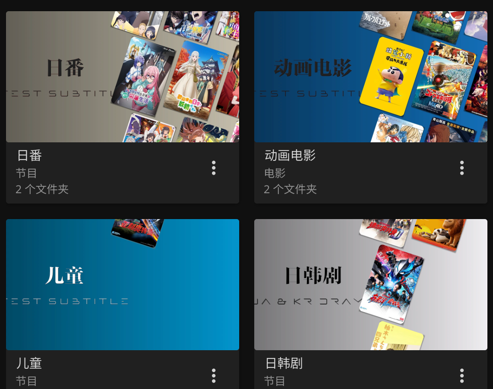

[license]: /LICENSE
[license-badge]: https://img.shields.io/github/license/Akimio521/AutoFilm?style=flat-square&a=1
[prs]: https://github.com/Akimio521/AutoFilm
[prs-badge]: https://img.shields.io/badge/PRs-welcome-brightgreen.svg?style=flat-square
[issues]: https://github.com/Akimio521/AutoFilm/issues/new
[issues-badge]: https://img.shields.io/badge/Issues-welcome-brightgreen.svg?style=flat-square
[release]: https://github.com/Akimio521/AutoFilm/releases/latest
[release-badge]: https://img.shields.io/github/v/release/Akimio521/AutoFilm?style=flat-square
[docker]: https://hub.docker.com/r/akimio/autofilm
[docker-badge]: https://img.shields.io/docker/pulls/akimio/autofilm?color=%2348BB78&logo=docker&label=pulls

<div align="center">

# AutoFilm

**一个为 Emby、Jellyfin 服务器提供直链播放的小项目** 

[![license][license-badge]][license]
[![prs][prs-badge]][prs]
[![issues][issues-badge]][issues]
[![release][release-badge]][release]
[![docker][docker-badge]][docker]


[说明文档](#说明文档) •
[部署方式](#部署方式) •
[Strm文件优点](#Strm文件优点) •
[TODO LIST](#todo-list) •
[更新日志](#更新日志) •
[贡献者](#贡献者) •
[Star History](#star-history)

</div>

# 说明文档
详情见 [AutoFilm 说明文档](https://blog.akimio.top/posts/1031/)

# 部署方式
1. Docker 运行
    ```bash
    docker run -d --name autofilm  -v ./config:/config -v ./media:/media -v ./logs:/logs akimio/autofilm
    ```

2. Docker 中手动触发特定任务
    ```bash
    docker exec autofilm python /app/run.py <任务ID>
    ```
    通过`docker exec`命令可以在运行中的容器内执行run.py脚本来手动触发特定任务。
2. Python 环境运行（Python3.12）
    ```bash
    python app/main.py
    ```

3. 手动触发特定任务
    ```bash
    python app/run.py <任务ID>
    ```
    通过`run.py`可以手动触发配置文件中定义的特定任务，而不需要等待定时任务执行。

# Strm文件优点
- [x] 轻量化 Emby 服务器，降低 Emby 服务器的性能需求以及硬盘需求
- [x] 运行稳定
- [x] 相比直接访问 Webdav，Emby、Jellyfin 服务器可以提供更好的视频搜索功能以及自带刮削器，以及多设备同步播放进度
- [x] 提高访问速度，播放速度不受 Emby / Jellyfin 服务器带宽限制（需要使用 [MediaWarp](https://github.com/Akimio521/MediaWarp)）

# TODO LIST
- [x] 从 config 文件中读取配置
- [x] 优化程序运行效率（异步处理）
- [x] 增加 Docker 镜像
- [x] 本地同步网盘
- [x] Alist 永久令牌
- [x] LibraryPoster（媒体库海报，感谢[HappyQuQu/jellyfin-library-poster](https://github.com/HappyQuQu/jellyfin-library-poster)）
- [ ] 使用 API 触发任务
- [ ] 通知功能
- [ ] ~~对接 TMDB 实现分类、重命名、刮削等功能~~
    > 已经向 [MoviePilot](https://github.com/jxxghp/MoviePilot) 提交支持对 Alist 服务器文件的操作功能的 PR，目前已经合并进入主线分支，可以直接使用 MoviePilot 直接刮削

# 功能演示
## LibraryPoster
美化媒体库海报封面图



# 更新日志
- 2025.9.26：v1.5.0，支持 BDMV 蓝光原盘文件结构，引入 Alist2StrmMode 枚举以简化模式管理，优化 LibraryPoster 对多路径媒体库的处理
- 2025.7.14：v1.4.0，修复 Ani2Alist 模块时间解析问题，新增 LibraryPoster 美化媒体库封面模块
- 2025.5.29：v1.3.3，Alist2Strm 模块支持添加删除空目录的功能；提高 Alist V3.45 兼容性；添加 m2ts 视频文件后缀到视频扩展集合；修复视频扩展集合中".wmv"缺失前缀错误
- 2025.4.4：v1.3.2，添加 .mpg 视频文件后缀；优化重试装饰器；优化重试装饰器；新增遍历文件间隔时间，防止被风控；修正部分方法名、返回变量类型、文档表述错误
- 2025.3.15：v1.3.1，修复重试装饰器参数类型错误；在 AlistStorage 中添加 model_config 以忽略特定类型避免 Cython 编译后无法使用；修改 AlistClient 中的异常捕获以避免捕获其他异常；使用 Cython 对 Docker 容器内的 py 文件编译，提高性能
- 2025.3.12：v1.3.0，增加汉字转拼音相关工具；修复 AlistStorage 属性调用错误问题；修复 RSS 订阅更新对 storage.addition2dict 结构中 url_structure 的处理；修复无法仅 token 实例化 AlistClient 对象问题；优化 Ani2Alist 运行逻辑；优化 Ani2Alist 性能，减少 URL 解码次数；优化 Alist2Strm 支持判断本地文件是否过期或损坏而进行重新处理
- 2025.1.10：v1.2.6 使用 RequestUtils 作为全局统一的 HTTP 请求出口、更新 Docker 镜像底包、Alist2Strm 新增同步忽略功能
- 2024.11.8：v1.2.5，Alist2Strm 模块新增同步功能；优化 AlistClient，减少 token 申请；支持使用永久令牌；优化日志功能
- 2024.8.26：v1.2.4，完善 URL 中文字符编码问题；提高 Python3.11 兼容性；Alist2Strm 的 mode 选项
- 2024.7.17：v1.2.2，增加 Ani2Strm 模块
- 2024.7.8：v1.2.0，修改程序运行逻辑，使用 AsyncIOScheduler 实现后台定时任务
- 2024.6.3：v1.1.0，使用 alist 官方 api 替代 webdav 实现“扫库”；采用异步并发提高运行效率；配置文件有改动；支持非基础路径 Alist 用户以及无 Webdav 权限用户
- 2024.5.29：v1.0.2，优化运行逻辑；Docker 部署，自动打包 Docker 镜像
- 2024.2.1：v1.0.0，完全重构 AutoFilm ，不再兼容 v0.1 ；实现多线程，大幅度提升任务处理速度
- 2024.1.28：v0.1.1，初始版本持续迭代

# 贡献者
<a href="https://github.com/Akimio521/AutoFilm/graphs/contributors">
  
</a>

# Star History
<a href="https://github.com/Akimio521/AutoFilm/stargazers">
    
</a>